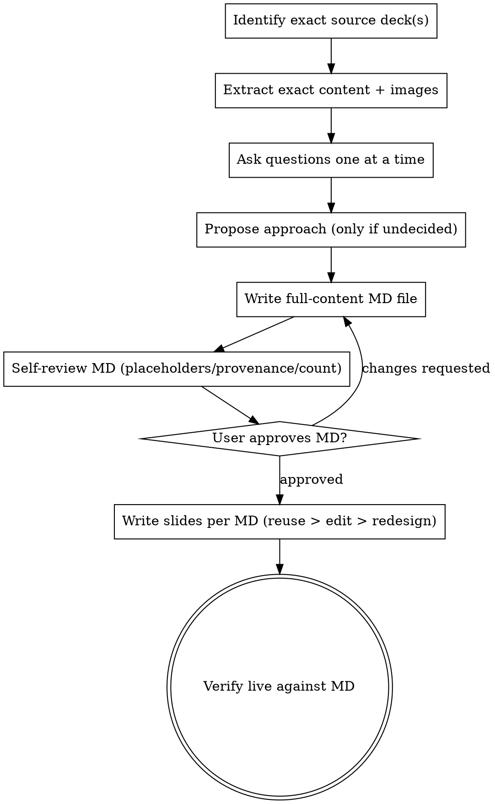

# /slides — Turn an existing presentation into an updated one, MD-first

Adapted from `superpowers:brainstorming`, retargeted from **coding** to
**doc/slide writing**. Same shape (ask → propose → design → approve → write →
review → approve again), different terminal artifact: a slide-content
markdown file and, only after that's approved, real slides — never code.

## Why this exists (2026-08-24)

A prior session-long attempt at this exact workflow (rebuild the "Develop at
Idea Velocity" keynote deck) repeatedly violated the user's actual intent:
default behavior kept *recreating* slide content in HTML/CSS instead of
*reusing* the user's real original slides/images, a written plan was executed
without checking it matched the user's actual goal ("enhance my original
presentation," not "give me a completely different one"), and an explicit
correction ("I want the exact same image as original pyramid but modified")
was given, briefly honored, then silently violated again several hours later
in the same session. This skill exists to make that class of failure
structurally harder, not just to remember not to do it.

<HARD-GATE>
Do NOT touch Google Slides, Claude Design, or any slide-authoring surface
until a full-content markdown draft has been written, shown to the user, and
explicitly approved. This applies even for "just a wording tweak."
</HARD-GATE>

<HARD-GATE>
Default is EXACT REUSE, not recreation. If a slide already exists as a real
image (in the current deck, an "original" deck, or any deck the user points
to), the default action is to extract and reuse that exact image — never to
rebuild it as HTML/CSS/SVG from scratch. Recreation is only allowed when
the user explicitly asks for a redesigned/rebuilt slide, and even then it
must be confirmed back to the user in the MD draft before any pixel is
touched, framed as "I'm going to REDESIGN slide N rather than reuse the
original — confirm?"
</HARD-GATE>

## Checklist

1. **Identify the exact source(s)** — which deck(s) are "the original"? Get
   real presentation IDs/URLs, not assumptions. If more than one deck has
   been referenced in conversation, ask which one is authoritative before
   doing anything else — do not guess, do not silently pick the most recent.
2. **Extract the source content exactly** — for every existing slide, pull
   the real text AND, where the slide is (or contains) an image, the real
   image itself (via `gog slides read-slide <id> <slideObjectId> --json` to
   get `contentUrl`s, then `curl` those URLs down to local files — never
   redraw from a description of what's on the slide).
3. **Ask clarifying questions one at a time** — target audience, which
   slides get wording-only edits, which get cut, which get added, how many
   new slides, style/length constraints. Multiple-choice where possible.
4. **Propose approach(es) only if genuinely undecided** — if the user has
   already stated the approach (e.g. "mostly reuse original, adjust wording,
   add a few slides like the plan"), do not re-litigate it; confirm scope
   details instead.
5. **Write the FULL exact content to one markdown file** —
   `docs/superpowers/specs/YYYY-MM-DD-<topic>-slides.md`. Structure: one
   section per slide, in final order, each tagged with its status and
   provenance:
   - `[UNCHANGED]` — reused verbatim from source deck X, slide N. Quote the
     exact original text. Note the real image asset path if it has one.
   - `[WORDING EDIT]` — show OLD and NEW text side by side, nothing else
     changed.
   - `[NEW]` — entirely new slide, full proposed content, note which
     existing slide (if any) it's inspired by.
   - `[REDESIGNED]` — explicitly flagged, with a one-line reason, per the
     hard-gate above.
   This file must contain the REAL, FINAL wording — not a summary, not
   placeholders, not "same as before." A reader should be able to approve
   or reject every single slide from this file alone, without opening any
   other tool.
6. **Iterate in the MD file** — the user reviews/edits this file directly or
   asks for changes in chat; keep revising the same file. Do not move to
   slide-writing until the user says something equivalent to "approved" /
   "looks good" / "ship it."
7. **Self-review before presenting for approval** — placeholder scan (no
   "TBD"/"similar to above"), provenance scan (every slide tagged, no
   untagged slide), and a `grep`-able count check: number of `[UNCHANGED]`
   + `[WORDING EDIT]` + `[NEW]` + `[REDESIGNED]` sections equals the stated
   final slide count.

<HARD-GATE>
7a. **Run `document-standards` over every `[NEW]` / `[WORDING EDIT]` /
`[REDESIGNED]` line before the MD goes to the user, and again before any
copy reaches a slide.** Load `~/.claude/skills/document-standards/SKILL.md`
and apply the Economy lane plus the AI-tell catalogue (especially *Artifact
meta-commentary*, *Preemptive reassurance*, *Slot-filled subhead*, and
*Empty slots stay empty*). Slide copy is the highest-risk surface for filler
because the layout has fixed slots — subtitle, kicker, caption, footer-note —
and an empty slot reads as unfinished, so the default behavior is to
generate plausible prose to occupy it.

Every line must name a fact, a constraint, a decision, or a consequence.
A subtitle that restates its own H1, or tells the audience how to feel, is
deleted — not reworded. Apply the skill's discriminator so this does not
become false-positive churn: real credibility claims ("real player, real
session — not a demo" defending an actual screenshot) survive; posture does
not.

Incident that created this gate (2026-08-24): the Agenda slide shipped with
"No prior context needed — here's the arc." — simultaneously *False-suspense
transition*, *Invitation framing*, and *Preemptive reassurance*, all already
catalogued in `document-standards`. The rule existed; nothing in the slide
path invoked it, so prose quality fell back on in-the-moment judgment, which
fills slots. Visual verification passed it because it rendered correctly and
was not factually wrong.
</HARD-GATE>
8. **User reviews the written MD file** — explicit gate, same as
   brainstorming's spec-review gate. Do not proceed on silence.
9. **Only then: write the actual slides** — per section:
   - `[UNCHANGED]`: re-insert the exact extracted original image at the
     right position. No recreation.
   - `[WORDING EDIT]`: prefer editing native text if the slide is
     text-native; if the slide is an image, prefer overlay/patch of just
     the changed text region over full recreation where feasible, and say
     so if full recreation is actually required (some visual change is
     unavoidable) before doing it.
   - `[NEW]` / `[REDESIGNED]`: build to the deck's existing design system,
     screenshot, and push — this is the only case where the earlier
     HTML/CSS-authoring workflow (Claude Design + headless Chrome capture +
     `gog slides insert-image`) is the right tool.
10. **Verify live** — re-export the real presentation, visually confirm
    every slide matches its MD-file section (unchanged slides pixel-match
    the source, edited slides show only the stated wording change, new
    slides match what was approved). Report any deviation explicitly.

## Process flow

## Standing rules carried over from the 2026-08-24 incident

- **A correction given once must be re-verified before every subsequent
  edit to the same asset**, not trusted to persist in context. Before
  touching any `[UNCHANGED]` or previously-corrected slide, re-read its MD
  section and restate the constraint back before acting.
- **Prohibition-type constraints decay faster than requirement-type ones**
  over a long session (see `docs/superpowers/research/2026-08-24-context-drift-constraint-decay.md`).
  Treat "don't recreate this" as higher-risk-of-drift than "do X," and
  re-anchor on it explicitly before any edit to that slide, every time.
- **A written plan that contradicts what the user actually asked for is not
  a plan to execute — it's a plan to flag.** If a plan or spec says
  "rebuild from scratch" but the user's stated goal is "enhance the
  original," stop and reconcile before writing anything.
- **Do not parallelize slide-content decisions.** Subagents may extract
  content or capture screenshots in parallel, but the actual "what does
  this slide say / does it match the original" judgment stays with the
  primary session, sequentially, with the user in the loop.

## Standing rules from the 2026-08-25 keynote-build session

- **Snapshot before every write, diff after.** `gog slides raw <id> >
  snapshot.json` before any edit; after, diff extracted text against the
  snapshot and flag every change outside the slide(s) you intended to touch.
  This caught real damage more than once this session (a subagent's edit
  silently deleted 7 elements from an unrelated slide) and is what makes
  "don't change text without approval" enforceable rather than aspirational.
  Report the diff count in the summary — "0 changes outside slides X/Y",
  never "looks right."
- **Diagram/graphic sources need a durable home, not `/tmp`.** An
  architecture diagram's HTML source and its `tokens.css` import both lived
  only in `/tmp`; by the time a one-word fix was needed, the CSS was already
  gone and the directory it lived in no longer existed. If a diagram's
  editable source is going to be touched more than once, commit it into the
  repo (with its dependencies) the first time it's built, not after it
  breaks.
- **For backup/durability, prefer a render over source reconstruction.**
  When a diagram only needs to be *backed up*, export and screenshot the
  live deck (`gog slides export --format pdf` + `pdftoppm -png -r 150`)
  rather than reconstructing a lost source file. The render is what actually
  shipped and was already verified; a reconstructed source can silently
  drop details a render can't (SVG connector arrows tied to an unrecorded
  original viewport width were lost on re-render here, present in the
  screenshot). Reconstruct the source only when the task is "make this
  editable again," not "back this up" — confirm which one is actually being
  asked for before spending effort on the harder path.
- **Categorize slide content against the deck's own section structure, not
  surface topic-matching.** Splitting bullets across two buckets (e.g.
  "dev workflow" vs. "the product"), check which of the deck's own sections
  each fact actually lives in before assigning it — a fact that *sounds*
  like generic process ("routing," "context budget") can belong entirely to
  one feature's internals if that's where the deck puts it. This produced a
  real miscategorization in a summary email that the user had to correct.
