# WorldArchitect.AI — System Architecture & Design Document

**Version**: 3.0
**Last Updated**: 2026-05-16
**Status**: Current

---

## Table of Contents

1. [Overview](#1-overview)
2. [Design Philosophy](#2-design-philosophy)
3. [High-Level System Architecture](#3-high-level-system-architecture)
4. [Core Proprietary Systems](#4-core-proprietary-systems)
   - 4.1 [Semantic Agent Routing](#41-semantic-agent-routing)
   - 4.2 [Prompt Engineering Library](#42-prompt-engineering-library)
   - 4.3 [Deterministic Token Budget Engine](#43-deterministic-token-budget-engine)
   - 4.4 [Mechanic Request Protocol](#44-mechanic-request-protocol)
   - 4.5 [Living World Faction System](#45-living-world-faction-system)
   - 4.6 [LLM-Decides / Server-Executes Pattern](#46-llm-decides--server-executes-pattern)
   - 4.7 [Three-Stage Context Compression](#47-three-stage-context-compression)
   - 4.8 [Social HP & Planning Protocol](#48-social-hp--planning-protocol)
5. [Data Flow Diagrams](#5-data-flow-diagrams)
   - 5.1 [Player Action → Streaming Response](#51-player-action--streaming-response)
   - 5.2 [Faction Background Tick](#52-faction-background-tick)
   - 5.3 [Agent Selection Priority Chain](#53-agent-selection-priority-chain)
   - 5.4 [Token Budget Allocation](#54-token-budget-allocation)
6. [Component Reference](#6-component-reference)
7. [Infrastructure](#7-infrastructure)
8. [Key Design Decisions](#8-key-design-decisions)
9. [Truly Novel Capabilities](#9-truly-novel-capabilities)

---

## 1. Overview

WorldArchitect.AI is a production-grade AI tabletop RPG platform that acts as a digital D&D 5e Game Master. It combines:

- **Flask API gateway** — HTTP translation + Firebase auth
- **MCP protocol server** — business logic exposed as JSON-RPC 2.0 tools
- **Multi-agent Gemini AI engine** — 14 specialized agents with 30 tuned prompt files (17,369 lines)
- **Firebase Firestore** — authoritative game state persistence
- **Living world simulation** — autonomous factions, time-tracked background events

The core design challenge is maintaining D&D 5e mechanical integrity (dice, stats, rules) while producing immersive narrative — simultaneously ensuring the LLM cannot silently cheat the mechanics it's supposed to enforce.

---

## 2. Design Philosophy

| Principle | Implementation |
|---|---|
| **LLM Decides, Server Executes** | LLM proposes operations; server validates, executes, stores in Firestore |
| **Zero Fabrication** | LLM cannot fabricate dice rolls — it requests them; server resolves via code execution |
| **Server is Source of Truth** | Firestore holds authoritative state; LLM receives context summaries only |
| **Semantic over Keyword** | Agent routing uses embedding cosine similarity, not string matching |
| **Story Context is Sacred** | Story context gets guaranteed ≥30% token allocation plus all budget leftovers |
| **Warnings over Assertions** | Soft failures with logging — no assertions that crash the game mid-session |
| **Essentials Mode** | Every prompt has a condensed `<!-- ESSENTIALS -->` block for token-constrained requests |

---

## 3. High-Level System Architecture

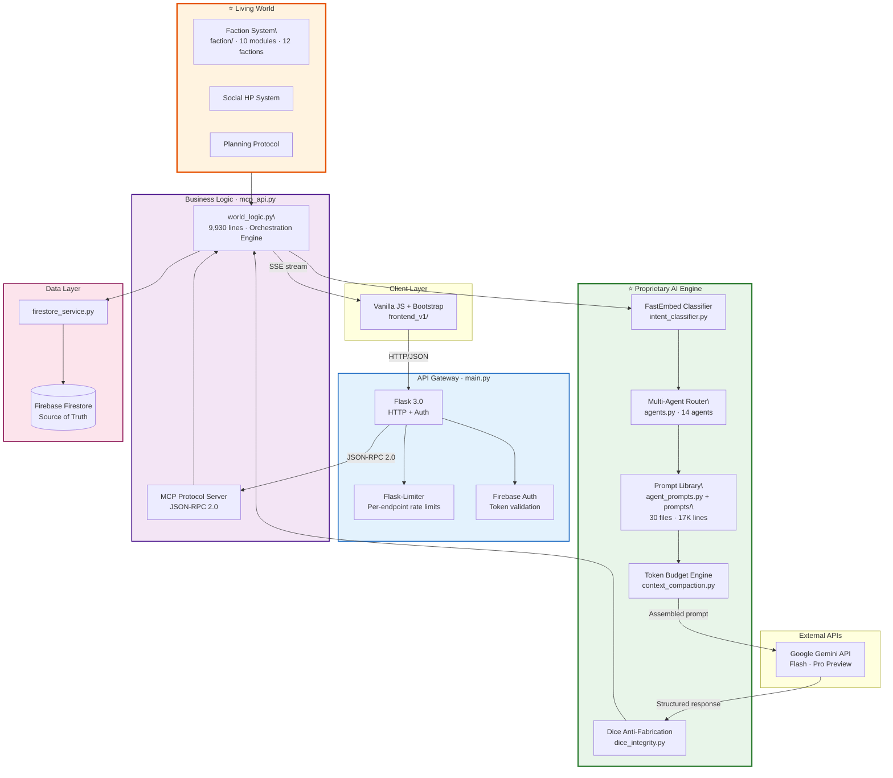

---

## 4. Core Proprietary Systems

### 4.1 Semantic Agent Routing

**Files**: `intent_classifier.py`, `agents.py` (3,844 lines)
**What it does**: Routes each player input to the correct specialized agent using local embedding similarity — no keyword matching, no regex.

#### Classifier

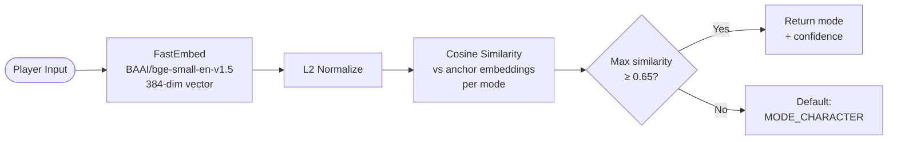

- Model: BAAI/bge-small-en-v1.5 (~133MB ONNX, loads async at startup)
- Threshold: `SIMILARITY_THRESHOLD = 0.65`
- Latency: <50ms (local inference, no API call)
- Security: Classifier is explicitly blocked from returning `MODE_GOD` (god mode must be explicit prefix)

#### Agent Priority Chain

| Priority | Agent | Trigger |
|---|---|---|
| 1 | `GodModeAgent` | `"GOD MODE:"` prefix or `mode="god"` |
| 2 | `StoryModeAgent` | Character creation completion override |
| 3 | `CampaignUpgradeAgent` | Ascension state active (state-based) |
| 4 | `CharacterCreationAgent` | Character creation active (state-based) |
| 5 | `PlanningAgent` | `"THINK:"` prefix or `mode="think"` |
| 6 | **Semantic Classifier** | All other inputs (primary brain) |
| 7 | API mode override | `mode="combat"`, `mode="rewards"`, etc. |
| 8 | `StoryModeAgent` | Default fallback |

#### Agents

| Agent | Mode | REQUIRED_PROMPTS | Specialization |
|---|---|---|---|
| `StoryModeAgent` | `character` | master, game_state, planning, narrative | Default storytelling |
| `CombatAgent` | `combat` | master, game_state, planning, mechanics, combat | Active combat |
| `PlanningAgent` | `think` | master, game_state, planning, think_mode | Strategic planning (time frozen) |
| `GodModeAgent` | `god` | master, game_state, god_mode | Admin/debug commands |
| `RewardsAgent` | `rewards` | master, game_state, planning, rewards | Loot + leveling |
| `InfoAgent` | `info` | master, game_state (trimmed) | Inventory/stat queries |
| `LevelUpAgent` | `level_up` | master, game_state, planning, level_up | Level-up flow |
| `DialogAgent` | `dialog` | master, game_state, dialog | Focused NPC conversation |
| `HeavyDialogAgent` | `dialog_heavy` | master, game_state, dialog, narrative | High-stakes dialogue |
| `FactionManagementAgent` | `faction` | master, game_state, faction_management, faction_minigame | Faction operations |
| `CharacterCreationAgent` | `character_creation` | master, game_state, character_creation | New character flow |
| `CampaignUpgradeAgent` | `campaign_upgrade` | master, game_state, divine/sovereign | Tier ascension ceremonies |
| `DeferredRewardsAgent` | `rewards` | master, game_state, planning, rewards | Deferred rewards flow |
| `SpicyModeAgent` | `spicy` | master, game_state, spicy_mode | Spicy/dramatic mode |

#### Prompt Loading Invariants

```
MANDATORY order:
  1. master_directive (always first — establishes authority)
  2. game_state + planning_protocol (consecutive — anchors schema)
  3. Mode-specific prompts after
```

---

### 4.2 Prompt Engineering Library

**Files**: `agent_prompts.py` (2,846 lines), `mvp_site/prompts/` (30 files, 17,369 lines total)

#### Prompt File Inventory

| File | Lines | Purpose |
|---|---|---|
| `game_state_instruction.md` | 3,009 | State schema, JSON I/O, entity structures |
| `faction_minigame_instruction.md` | 2,274 | Faction management minigame rules |
| `narrative_system_instruction.md` | 1,402 | Storytelling, action resolution, guardrails |
| `combat_system_instruction.md` | 1,155 | Combat initiative, damage, status |
| `living_world_instruction.md` | 862 | NPC autonomy, faction events, world simulation |
| `mechanics_system_instruction_code_execution.md` | 811 | D&D 5e mechanics + code execution |
| `mechanics_system_instruction.md` | 698 | D&D 5e mechanics (no code execution) |
| `faction_management_instruction.md` | 634 | Faction management backend rules |
| `divine/divine_leverage_system.md` | 560 | God-tier campaign mechanics |
| `rewards_system_instruction.md` | 504 | XP, loot, level-up triggers |
| `dialog_system_instruction.md` | 444 | Dialog focus mode |
| `planning_protocol.md` | 417 | Planning block schema + rules |
| `think_mode_instruction.md` | 416 | Think mode time-freeze + planning |
| `god_mode_instruction.md` | 365 | Admin command handling |
| `master_directive.md` | 331 | Authority hierarchy + D&D 5e SRD authority |
| `multiverse/sovereign_*.md` | 270×2 | Multiverse tier ascension |
| `divine/divine_ascension_ceremony.md` | 270 | Divine ascension ceremony |

#### Essentials Mode

Every prompt file contains an `<!-- ESSENTIALS -->` block — a condensed version of critical rules used when the token budget is constrained. The builder strips the full content and uses only the essentials block, preserving core behavior while reducing token cost by up to 80%.

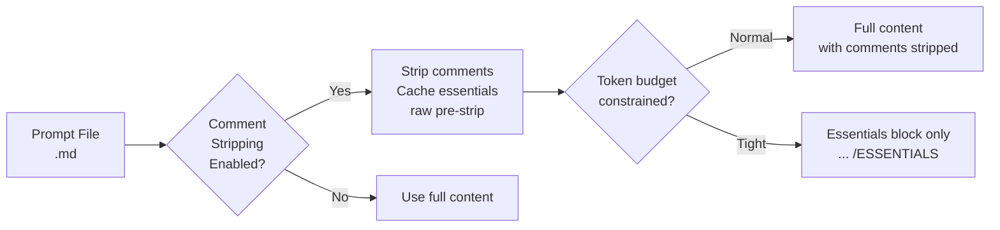

#### Dynamic Schema Injection

`planning_protocol.md` contains `{{PLANNING_BLOCK_SCHEMA}}` and `{{CHOICE_SCHEMA}}` placeholders. `agent_prompts.py` injects the current Pydantic schema at load time, ensuring prompt definitions never drift from code.

---

### 4.3 Deterministic Token Budget Engine

**File**: `context_compaction.py` (1,005 lines)
**What it does**: Allocates the LLM input token budget across 5 components using a min-first / fill-to-max algorithm with guaranteed minimums.

#### Budget Allocation Constants

| Component | Min % | Max % | Compaction Strategy |
|---|---|---|---|
| `system_instruction` | 10% | 50% | No compaction unless >100k tokens |
| `game_state` | 5% | 20% | Drop fields by priority tier |
| `core_memories` | 20% | 30% | Keep CRITICAL-tagged + 3 most recent |
| `entity_tracking` | 3% | 15% | Drop low-priority NPCs first |
| `story_context` | **30% (guaranteed)** | 60% | Most recent turns, truncate oldest |

Total minimum: 68% — leaves 32% for fill-to-max allocation.
Story context gets all leftover budget after other components fill to max.

#### Allocation Algorithm

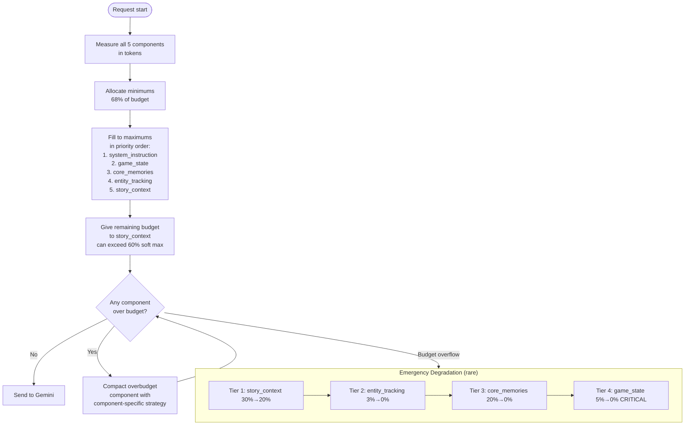

#### Token Windows (Gemini 3 Flash)

```
Context window:     1,000,000 tokens
Compaction limit:     300,000 tokens (stability cap)
Output reserve:        60,000 tokens (20%)
Max input available:  240,000 tokens
```

---

### 4.4 Mechanic Request Protocol

**File**: `dice_integrity.py` (1,566 lines)
**What it does**: Enforces that the LLM never fabricates dice roll results. It requests rolls; the server (via Gemini code execution) resolves them.

#### The Problem

Without enforcement, LLMs fabricate dice numbers in narrative prose:
> *"You roll a 19, hitting the goblin for 12 damage!"* — **fabricated, unverifiable**

#### The Solution

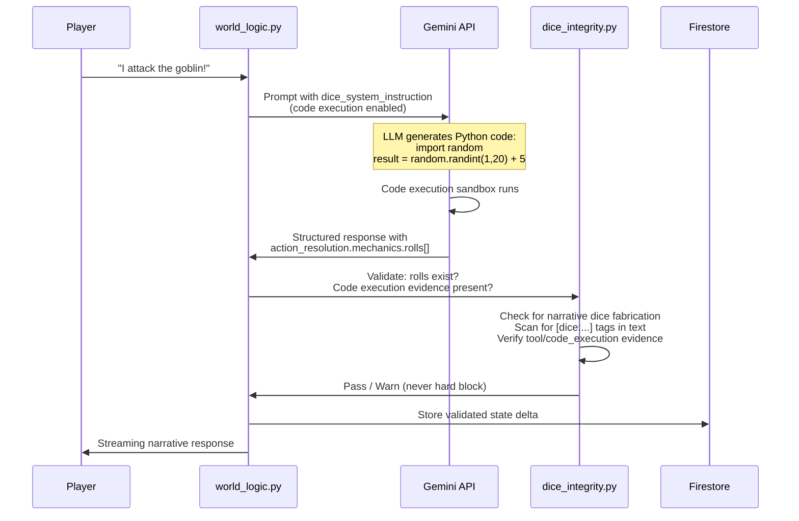

#### Anti-Fabrication Detection

`dice_integrity.py` scans each response for:

1. **Narrative dice notation** — regex `\b\d*d\d+(?:\s*[+\-]\s*\d+)?\b` in narrative text
2. **`[dice:...]` tags** — explicit dice tag pattern
3. **"rolls a 15" patterns** — only flagged if within 80 chars of combat context keywords
4. **Structured response dice** — checks `action_resolution.mechanics.rolls[]` is the sole authoritative source

Schema violation warnings:
- `audit_events` present but `rolls[]` empty → `SCHEMA_VIOLATION` logged
- Dice in narrative without code execution evidence → warning logged
- `NATIVE_TWO_PHASE` strategy: certain warnings suppressed (server-executed tool calls)

#### Audit Trail

Every resolved roll is stored in:
```json
{
  "action_resolution": {
    "mechanics": {
      "rolls": [
        { "type": "attack", "die": "d20", "result": 17, "modifier": 5, "total": 22 }
      ],
      "audit_events": ["attack_vs_ac_14_hit"]
    },
    "reinterpreted": false,
    "audit_flags": []
  }
}
```

---

### 4.5 Living World Faction System

**Directory**: `mvp_site/faction/` (10 modules)
**What it does**: Simulates 12 autonomous factions per campaign with independent goals, resources, and inter-faction combat — running on dual time tracks (real-time triggers + offline catch-up).

#### Module Breakdown

| Module | Lines | Responsibility |
|---|---|---|
| `battle_sim.py` | ~300 | D&D 5e SRD battle simulation (fast/detailed/deterministic modes) |
| `ai_factions.py` | ~400 | AI decision-making for faction actions |
| `combat.py` | ~250 | Faction vs faction combat resolution |
| `dual_mode.py` | ~200 | Dual time tracking (online + offline) |
| `intel.py` | ~150 | Intelligence gathering between factions |
| `rankings.py` | ~100 | Faction power rankings and tier system |
| `resources.py` | ~150 | Gold, units, territory resource management |
| `upkeep.py` | ~120 | Per-tick cost enforcement and unit attrition |

#### Time Tracking Architecture

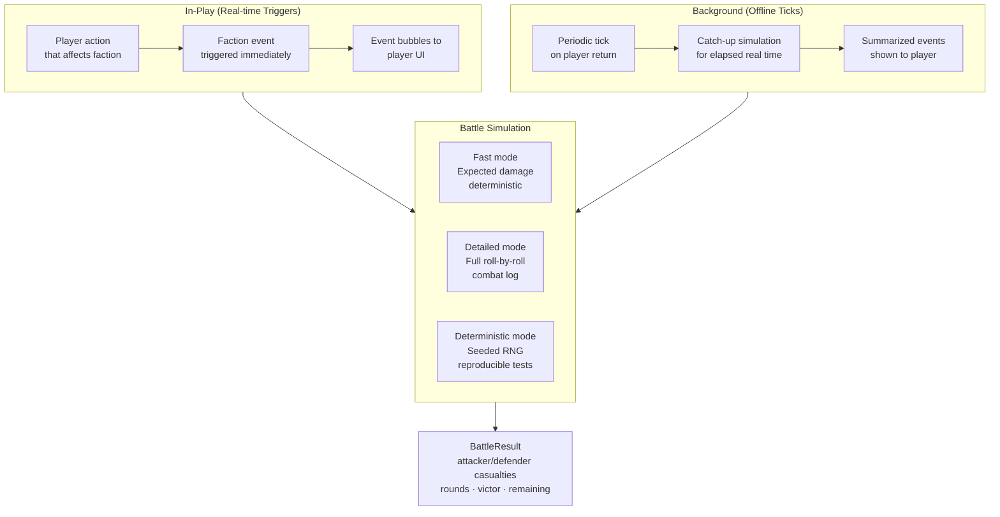

#### Faction State

Each campaign has up to 12 factions with:
- `faction_power` score
- `units` (typed by `srd_units.py` — D&D 5e SRD unit definitions)
- `resources` (gold, territory)
- `morale` (rout at `MORALE_ROUT_THRESHOLD`)
- `intel` gathered on rival factions
- `ai_decision` history

---

### 4.6 LLM-Decides / Server-Executes Pattern

**File**: `world_logic.py` (9,930 lines)
**What it does**: The LLM proposes game state changes as structured operations; the server validates and applies them to Firestore. The LLM never directly writes state.

#### Data Flow

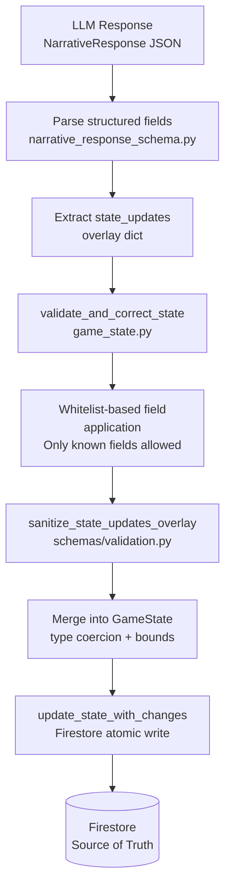

#### What the LLM Controls vs. Server Controls

| Aspect | LLM Role | Server Role |
|---|---|---|
| Narrative text | Generates | Passes through to client |
| State delta | Proposes via `state_updates` | Validates, sanitizes, applies |
| Dice results | Requests (never generates) | Executes via code execution |
| HP changes | Proposes delta | Validates bounds (0 to max HP) |
| Inventory | Proposes adds/removes | Validates item schemas |
| Combat state | Proposes initiative/combatants | Validates structure |
| Time advancement | Proposes | Validates against `mode_advances_time()` |

#### State Validation Pipeline

```python
# Simplified flow from game_state.py
state = validate_and_correct_state(raw_state)          # Type coercion
state = sanitize_state_updates_overlay(state_updates)   # Whitelist filter
state = merge_state_updates(current_state, state)       # Merge with bounds
firestore_service.update_state_with_changes(state)      # Atomic write
```

---

### 4.7 Three-Stage Context Compression

**Files**: `context_compaction.py`, `memory_utils.py`, `game_state.py`
**What it does**: Compresses campaign history into a fixed token budget while preserving narrative coherence across 1000+ turn campaigns.

#### The Three Stages

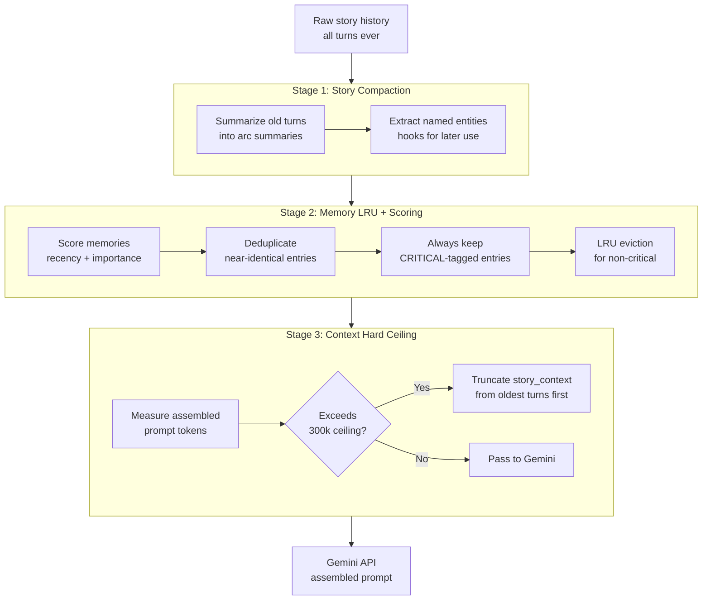

#### Memory Budget (Core Memories)

```
BUDGET_CORE_MEMORIES_MIN = 20%   # Campaign-critical facts over 1000+ turns
BUDGET_CORE_MEMORIES_MAX = 30%
select_memories_by_budget()      # memory_utils.py — token-aware selection
format_memories_for_prompt()     # memory_utils.py — formats for LLM injection
```

CRITICAL-tagged memories (prefixed `"CRITICAL:"`) are always preserved regardless of budget. These are manually set GM notes or system-detected key events.

---

### 4.8 Social HP & Planning Protocol

**Files**: `prompts/narrative_system_instruction.md`, `prompts/planning_protocol.md`

#### Social HP System

Replaces pass/fail skill checks with a multi-roll resistance model for major NPCs.

```
NPC Tiers:
  Commoner          1-2 HP
  Merchant/Guard    2-3 HP
  Noble/Knight      3-5 HP
  Lord/General      5-8 HP
  King              8-12 HP
  God               15+ HP

Request Difficulty Multiplier:
  Teaching/Alliance   1×  (base HP)
  Betray beliefs      2×
  Submit/Surrender    3×

Example: King submitting → 10 base × 3 = 30 HP challenge
```

Every active Social HP challenge shows a `[SOCIAL SKILL CHALLENGE: NPC]` status block in **every** response — the system prompt explicitly forbids omitting it on continuation turns.

#### Planning Protocol

Two modes with identical schema, different time behavior:

| Mode | Trigger | Time | Agent |
|---|---|---|---|
| **Think Mode** | `THINK:` prefix | FROZEN (+1 microsecond) | `PlanningAgent` |
| **Story Mode** | Every story response | ADVANCES normally | `StoryModeAgent` |

Planning block structure (injected from Pydantic schema at load time):
```json
{
  "thinking": "...",
  "context": "...",
  "choices": [
    {
      "id": "unique_id",
      "text": "Short label",
      "description": "Full description",
      "risk_level": "low|medium|high",
      "pros": ["..."],
      "cons": ["..."],
      "confidence": "low|medium|high"
    }
  ]
}
```

**Critical ordering rule**: Parallel execution choices MUST be placed last in the `choices[]` array.

---

## 5. Data Flow Diagrams

### 5.1 Player Action → Streaming Response

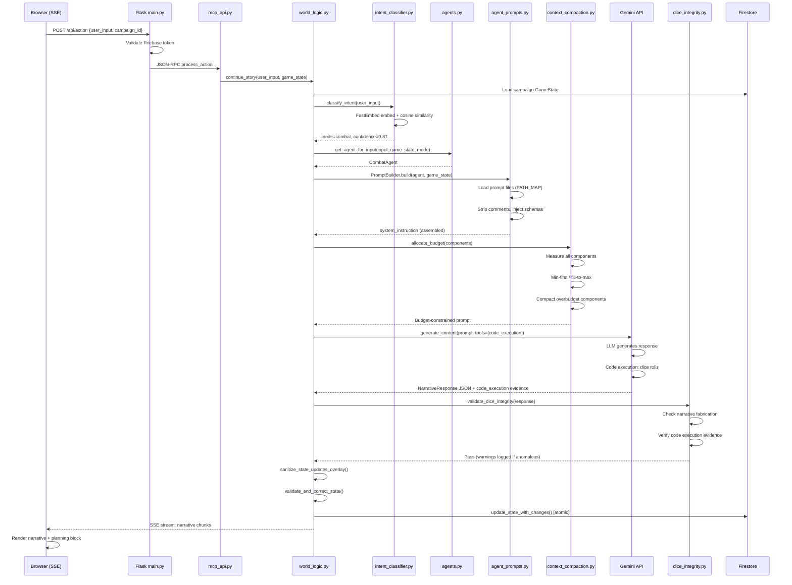

---

### 5.2 Faction Background Tick

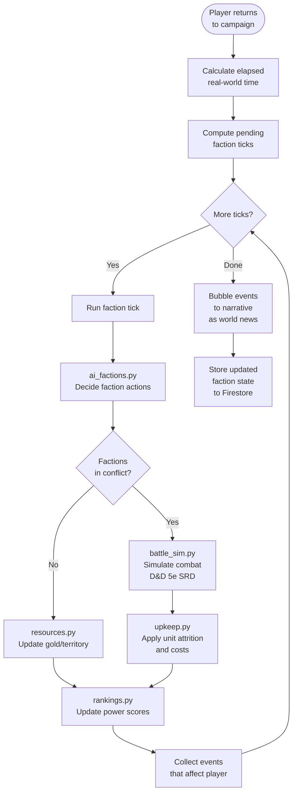

---

### 5.3 Agent Selection Priority Chain

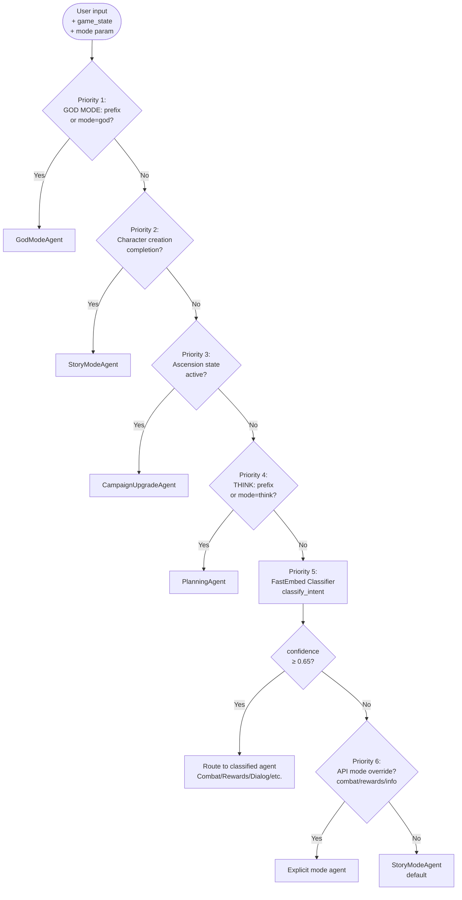

---

### 5.4 Token Budget Allocation

```mermaid
flowchart LR
    TOTAL[Total budget\n240k tokens\nGemini Flash] --> MEASURE

    subgraph MEASURE["Step 1: Measure"]
        M1[system_instruction]
        M2[game_state]
        M3[core_memories]
        M4[entity_tracking]
        M5[story_context]
    end

    MEASURE --> MINS

    subgraph MINS["Step 2: Allocate Minimums (68%)"]
        MIN1[system: 10%\n= 24k]
        MIN2[state: 5%\n= 12k]
        MIN3[memory: 20%\n= 48k]
        MIN4[entity: 3%\n= 7.2k]
        MIN5[story: 30%\n= 72k ⭐GUARANTEED]
    end

    MINS --> FILL

    subgraph FILL["Step 3: Fill to Max (priority order)"]
        F1[system → up to 50%]
        F2[game_state → up to 20%]
        F3[core_memories → up to 30%]
        F4[entity → up to 15%]
        F5[story → up to 60%\n+ ALL leftovers ⭐]
    end

    FILL --> COMPACT["Step 4: Compact\nany over-budget\ncomponent"]
    COMPACT --> SEND[Assembled prompt\nto Gemini]
```

---

## 6. Component Reference

### Core Python Modules

| File | Lines | Role |
|---|---|---|
| `world_logic.py` | 9,930 | Main orchestration: action handling, state management, LLM coordination |
| `agents.py` | 3,844 | Agent definitions, routing, prompt order invariants |
| `agent_prompts.py` | 2,846 | Prompt builder, file loading, schema injection, essentials mode |
| `narrative_response_schema.py` | 4,344 | LLM response parsing, JSON extraction, schema validation |
| `game_state.py` | 4,424 | GameState class, state coercion, validation, XP/level logic |
| `firestore_service.py` | 4,107 | Campaign CRUD, state persistence, atomic writes |
| `llm_service.py` | 9,072 | Gemini client, streaming, multi-provider support, model fallback |
| `intent_classifier.py` | 1,350 | FastEmbed classifier, anchor embeddings, cosine similarity |
| `dice_integrity.py` | 1,566 | Anti-fabrication detection, code execution validation |
| `context_compaction.py` | 1,005 | Token budget allocation, component compaction |
| `entity_tracking.py` | 68 | NPC/entity context for current scene |
| `memory_utils.py` | 280 | Memory scoring, dedup, CRITICAL-tag preservation |
| `mvp_site/campaign_divine.py` | 189 | Divine/sovereign ascension state helpers |
| `campaign_upgrade.py` | 194 | Campaign tier upgrade logic |

### Faction System (`mvp_site/faction/`)

| File | Role |
|---|---|
| `battle_sim.py` | D&D 5e SRD battle simulation (3 modes) |
| `ai_factions.py` | AI decision-making per faction |
| `combat.py` | Faction vs faction combat |
| `dual_mode.py` | Dual time tracking (online + offline ticks) |
| `intel.py` | Inter-faction intelligence gathering |
| `rankings.py` | Power score + tier rankings |
| `resources.py` | Gold, territory, unit management |
| `upkeep.py` | Per-tick cost enforcement |
| `srd_units.py` | D&D 5e SRD unit definitions |
| `tools.py` | MCP tool definitions for faction operations |
| `unit_types.py` | Unit type definitions |
| `visualizations.py` | Faction state visualization helpers |

### Prompts (`mvp_site/prompts/`)

| Directory | Contents |
|---|---|
| `prompts/` | 30 core instruction files (17,369 lines total) |
| `prompts/divine/` | Divine ascension ceremony + leverage system |
| `prompts/multiverse/` | Sovereign (multiverse tier) ascension |

### Frontend (`mvp_site/frontend_v1/`)

| File | Role |
|---|---|
| `app.js` | Main application shell |
| `api.js` | HTTP client to Flask backend |
| `auth.js` | Firebase auth flow |
| `js/streaming.js` | SSE stream parsing + rendering |
| `js/campaign-wizard.js` | Campaign creation flow (1,190 lines) |
| `js/interface-manager.js` | UI state + panel management |
| `js/planning-block.js` | Planning block rendering + choice UI |
| `js/animation-helpers.js` | Narrative transition animations |

---

## 7. Infrastructure

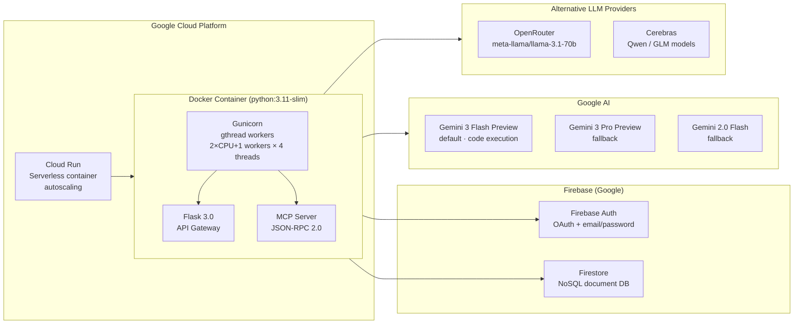

### Key Configuration

| Variable | Default | Purpose |
|---|---|---|
| `GEMINI_API_KEY` | env required | Gemini API authentication |
| `GOOGLE_APPLICATION_CREDENTIALS` | `~/serviceAccountKey.json` | Firebase Admin SDK |
| `MOCK_SERVICES_MODE` | `false` | Enable mock Gemini + Firestore for testing |
| `TESTING_AUTH_BYPASS` | `false` | Bypass Firebase auth in integration tests |
| `ENABLE_PROMPT_COMMENT_STRIPPING` | `true` | Strip prompt file comments before caching |
| `CAMPAIGN_RATE_LIMIT` | `100/hr, 20/min` | Per-endpoint rate limiting |

### Timeout Guardrail

All layers pinned to **600 seconds (10 minutes)**:
- Cloud Run service timeout
- Gunicorn worker timeout
- MCP client timeout
- Flask request timeout

Source of truth: `scripts/timeout_config.sh`

---

## 8. Key Design Decisions

### Why FastEmbed instead of keyword matching?

Keywords are fragile — "I want to fight" and "let's do battle" route differently with keywords, identically with embeddings. FastEmbed runs locally (<50ms), adds no API cost, and handles semantic variation naturally. The classifier was the explicit solution to the "NO KEYWORD MATCHING" mandate in `CLAUDE.md`.

### Why does story context get all leftover budget?

Story context (recent narrative history) is the most critical component for maintaining narrative coherence. System instructions and game state are relatively stable in size. Giving story context guaranteed minimums plus all overflow budget ensures the LLM can always see recent player actions even in long campaigns.

### Why no automatic model fallback to larger context?

See `docs/context_budget_design.md`: cost unpredictability + voice inconsistency. Fallback to a different model mid-session changes personality. The budget engine instead compresses inputs to fit within the current model's window.

### Why validate state updates with a whitelist?

The LLM produces free-form JSON `state_updates` dicts. Without a whitelist, a malformed or adversarial response could corrupt arbitrary game state fields. `sanitize_state_updates_overlay()` in `schemas/validation.py` enforces that only known fields with correct types can be applied.

### Why are prompt files `.md` instead of code strings?

Version control, diffs, and iterability. Prompt engineering is a design discipline — `.md` files are readable, commentable, and can be reviewed in PRs. The essentials blocks (`<!-- ESSENTIALS -->`) act as a built-in tiered compression system without requiring separate files.

### Why essentials mode instead of just shorter prompts?

Essentials mode preserves the full prompt for normal requests (best quality) while having a compact fallback automatically available when tokens are tight. A single file maintains both versions, eliminating drift between normal and compressed variants.

---

## 9. Truly Novel Capabilities

This section documents capabilities that, based on analysis of the AI TTRPG and agentic AI landscape, have no direct equivalents in public systems. Each claim is tied to specific code files and functions that can be independently verified.

### 9.1 Player-Invented Persistent Laws (God Mode Directives)

**Problem**: AI TTRPG platforms treat the LLM's behavior as fixed by the developer. Players cannot extend game mechanics at runtime without code changes.

**What WorldArchitect.AI does**: Players type natural-language directives via `GOD MODE:` prefix (e.g., `GOD MODE: always apply the Guidance spell to Persuasion checks`). The server:

1. Validates the directive — behavioral rules are kept, state values (e.g., "HP is 50") are rejected server-side via `_should_reject_directive()` in `mvp_site/world_logic.py:5292`
2. Timestamps and persists it in `custom_campaign_state.god_mode_directives` in Firestore
3. Injects it into **every subsequent agent's system prompt** via `build_god_mode_directives_block()`, sorted newest-first for precedence

The LLM receives these directives in its system prompt before every response and is instructed to treat them as binding. Conflicting directives resolve by recency (newest wins).

```python
# game_state.py:2755
def add_god_mode_directive(self, directive: str) -> None:
    """Add a God Mode directive to the campaign rules.
    These directives persist across sessions and are injected into prompts."""
    directives.append({"rule": directive, "added": datetime.datetime.now(UTC).isoformat()})

# agent_prompts.py:2194
directives_block = self.build_god_mode_directives_block()
if directives_block:
    parts.insert(insert_pos, directives_block)  # Injected before every LLM call
```

**Nearest comparisons**:
- *AI Dungeon world info*: static key-value facts, not behavioral mandates with versioned precedence
- *Jenova.ai*: static world-building snippets, not player-authored runtime mechanics
- *Minecraft datapacks*: require JSON authoring and server restart, not natural-language runtime injection

**Key files**: `mvp_site/game_state.py:2755`, `mvp_site/agent_prompts.py:1799`, `mvp_site/world_logic.py:5292`

---

### 9.2 Zero Fabrication — Structural Prevention of LLM Dice Cheating

**Problem**: LLMs generate dice results in narrative prose. These results are unverifiable, subject to narrative bias (the GM "wants" good drama), and cannot be audited. No public AI GM platform addresses this structurally.

**What WorldArchitect.AI does**: The architecture makes dice fabrication structurally impossible at two levels:

**Level 1 — Structural**: The LLM must emit a `tool_requests` field or use Gemini code execution to trigger dice resolution. The server executes `random.randint()` and returns authoritative results. The LLM then narrates from those results.

**Level 2 — Audit** (`dice_integrity.py`, 1,566 lines): Every response is scanned for fabrication via four independent signals:

| Signal | Detection | Code |
|---|---|---|
| Code execution path | Did `random.randint` actually run? | `_is_code_execution_fabrication()` |
| Narrative dice text | LLM wrote `"rolls a 17"` without tool evidence | `_detect_narrative_dice_fabrication()` |
| Tool audit trail | Was a dice tool called and resolved? | `_log_fabricated_dice_if_detected()` |
| RNG provenance | `server_tool` vs `code_execution` tagging | `provider_utils.py:144` |

Violations trigger warnings and player-visible flags. The design never hard-blocks (warnings only), but every violation is logged with full context.

**Nearest comparisons**:
- *OpenAI function calling*: tools exist, but no RPG-specific fabrication audit or RNG provenance tracking
- *Gemini tool_use*: server can execute tools, but no TTRPG fairness audit layer
- *AI Dungeon*: LLM generates dice numbers directly in prose — entirely unverified

**Key files**: `mvp_site/dice.py` (server RNG), `mvp_site/dice_integrity.py:54` (fabrication detection), `mvp_site/dice_strategy.py` (provider routing)

---

### 9.3 Campaign Tier System — Scoped Runtime Rule Extension

**Problem**: Standard D&D 5e rules are fixed. Campaigns that evolve beyond base D&D (divine ascension, multiverse mechanics) require new rule sets that must be consistently enforced across all agents.

**What WorldArchitect.AI does**: Campaigns can be upgraded to **Divine** or **Sovereign** tiers. The tier is stored in `custom_campaign_state.campaign_tier` and detected per-request. The appropriate rule document (Divine Leverage system or Sovereign Protocol) is loaded from disk and appended to **every agent's** system prompt for that request, without code changes.

```python
# agent_prompts.py:2236
def _append_campaign_tier_prompts(self, parts: list[str]) -> None:
    campaign_tier = self._resolve_campaign_tier()
    if campaign_tier == CAMPAIGN_TIER_DIVINE:
        divine_system = _load_instruction_file(PROMPT_TYPE_DIVINE_SYSTEM)
        parts.append(divine_system)   # Full rule document injected
    elif campaign_tier == CAMPAIGN_TIER_SOVEREIGN:
        sovereign_system = _load_instruction_file(PROMPT_TYPE_SOVEREIGN_SYSTEM)
        parts.append(sovereign_system)
```

This enables campaign-scoped rule extension: two simultaneous campaigns can run under completely different rule sets with no server configuration change.

**Key files**: `mvp_site/campaign_divine.py`, `mvp_site/agent_prompts.py:2236`, `mvp_site/constants.py` (`DIVINE_SYSTEM_PATH`, `SOVEREIGN_SYSTEM_PATH`)

---

### 9.4 Dynamic Ruleset Ingestion — Auto-Generate Schemas from Pasted Docs

**Problem**: AI TTRPG platforms support only the mechanics they were coded with. Adding a homebrew mechanic (e.g., a Corruption tracker, custom Sanity system, or domain resource) requires a developer to add schema fields, migrations, and prompt edits.

**What WorldArchitect.AI does**: Users paste a natural-language rules description in God Mode. The LLM acts as a schema parser:

1. **User pastes rules** — e.g., `GOD MODE: My campaign has a Corruption mechanic, 0–100. It increases by 10 per undead kill and adds disadvantage to CHA checks when above 60.`
2. **LLM extracts the schema** — field name (`corruption`), type (`integer`), range (`0–100`), and enforcement rule
3. **`state_updates` initializes it** — `{"custom_campaign_state": {"corruption": 0}}` — persisted in Firestore via the standard state-delta path
4. **`directives.add` enforces it** — `"Track corruption (0–100). Add disadvantage to CHA checks when corruption > 60."` — injected into all future agent system prompts

**Why this works without code changes**: `CustomCampaignState` in `game_state.schema.json` is declared as an open object — `"description": "Campaign-specific state beyond core D&D mechanics. This is the primary extension point for WorldArchitect-specific features."` — with `additionalProperties: true` on key sub-objects. Firestore (NoSQL) accepts any field the LLM writes. No schema migration is needed.

**Schema injection at runtime** (`agent_prompts.py:411`): Prompt files use `{{SCHEMA:TypeName}}` placeholders. `_inject_dynamic_schema_docs()` resolves them at request time from `game_state.schema.json`. This means adding a new type to the schema file makes it immediately available for injection into any prompt without code deploys.

```
User pastes rulebook excerpt
         │
    God Mode agent
         │
    LLM parses mechanics → state_updates (new fields in custom_campaign_state)
                         → directives.add (enforcement rules)
         │
    world_logic.py applies state delta to Firestore
         │
    Next request: custom fields appear in game_state context
                  directives appear in system prompt
```

**Nearest comparisons**:
- *AI Dungeon world info*: static key-value facts, not structured typed fields with runtime enforcement
- *Foundry VTT modules*: require a developer to write JS module code; no LLM-driven schema inference
- *D&D Beyond homebrew*: structured form UI only, not natural-language ingestion

**Key files**: `mvp_site/prompts/god_mode_instruction.md` (God Mode interface), `mvp_site/schemas/game_state.schema.json:2338` (`CustomCampaignState` open schema), `agent_prompts.py:411` (`_inject_dynamic_schema_docs`)

---

### 9.5 Codified Agent Debugging Ladder (/4layer)

**Problem**: AI-assisted development produces "fake passing" tests — mocks that pass CI but don't catch real bugs. Without a structured reproduction protocol, debugging degrades into ad-hoc investigation.

**What WorldArchitect.AI does**: The `/4layer` slash command enforces a **four-layer minimal reproduction ladder**. Each layer must be executed in order; the ladder stops at the layer that reproduces the issue.

```
Layer 1: Unit tests          → mvp_site/tests/
         Fast, isolated, no server needed

Layer 2: End-to-end tests    → mvp_site/tests/test_end2end/
         Full code path, mock services allowed

Layer 3: Real MCP/HTTP tests → testing_mcp/
         Real local server, real Firestore or mock, no browser

Layer 4: Browser automation  → testing_ui/
         Full stack: real server + real browser via Playwright
```

Each layer produces **evidence bundles** at canonical absolute paths:
```
/tmp/worldarchitectai/<branch>/<test_name>/latest/
  ├── server.pid           # Confirms which server instance ran
  ├── git.diff             # Exact code at time of test
  ├── test.log             # Full stdout/stderr
  └── screenshot.png       # Browser state (Layer 4 only)
```

The `latest` symlink always points to the most recent iteration. Evidence bundles are checked into `/tmp/` (not the repo) to stay lightweight but reproducible within a session.

**Why this matters**: The ladder prevents "Layer 4 passed, Layer 1 is mocked" failures. If Layer 1 passes but Layer 3 fails, the bug is in server integration, not business logic. This classification directly informs which file to fix.

#### Evidence Integrity Requirements

Evidence bundles are tamper-resistant by construction (`.claude/skills/evidence-standards.md`, 1,146 lines):

- **SHA256 checksums**: Every file in the bundle gets a companion `.sha256` file generated post-write via `_write_checksum_for_file()`. Self-invalidating checksums (embedded in JSON) are explicitly banned.
- **Git provenance**: `capture_git_provenance()` (`testing_mcp/lib/evidence_utils.py:505`) captures HEAD SHA, branch, diff-stat vs main, commits-ahead, and working tree state. Stored in `metadata.json` alongside test results.
- **Mock invalidation rule**: Mock mode results are explicitly invalid for behavior claims. Production validation requires real service calls (real Firestore, real LLM, or real server). Enforced by review convention.
- **Required files per bundle**: `run.json` (scenarios array), `metadata.json` (git + server state), `evidence.md` (human summary), `methodology.md`, `request_responses.jsonl` (raw MCP pairs), `llm_request_responses.jsonl` (raw LLM payloads).

**Key files**: `.claude/commands/4layer.md` (protocol), `.claude/skills/evidence-standards.md` (1,146-line spec), `testing_mcp/lib/evidence_utils.py:505` (provenance capture), `CLAUDE.md` (evidence path standards)
