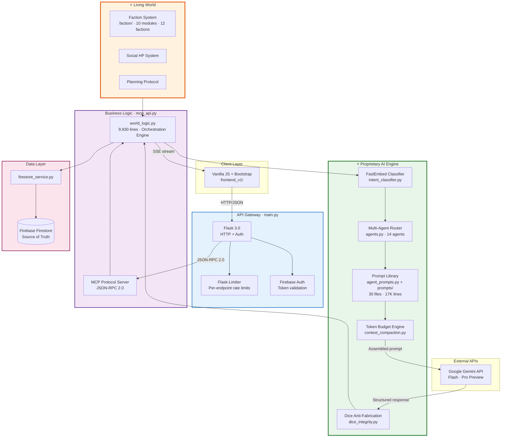

# WorldArchitect.AI

> AI-powered digital Dungeon Master — production-grade D&D 5e platform with semantic agent routing, deterministic dice, living world factions, and a 14-agent Gemini AI engine.

## Quick Links

| Resource | Link |
|---|---|
| **System Architecture (deep doc)** | [`docs/design/system-architecture.md`](docs/design/system-architecture.md) |
| **LLM Wiki** | [`~/llm_wiki/`](https://github.com/jleechanorg/worldarchitect.ai) (entities + concepts) |
| **Live demo** | [worldarchitect.ai](https://worldarchitect.ai) |
| **Repo** | [jleechanorg/worldarchitect.ai](https://github.com/jleechanorg/worldarchitect.ai) |

---

## Table of Contents

1. [Executive Summary](#executive-summary)
2. [System Architecture](#system-architecture)
3. [Core Proprietary Systems](#core-proprietary-systems)
4. [Tech Stack](#tech-stack)
5. [Testing & Evidence](#testing--evidence)
6. [Project Structure](#project-structure)

---

## Executive Summary

WorldArchitect.AI is a production Flask + MCP server that acts as a D&D 5e Game Master. It solves the core tension between **mechanical integrity** (dice, stats, rules) and **narrative immersion** by enforcing *LLM Decides, Server Executes* — the LLM proposes operations, the server validates and persists them.

**Key numbers** (verified against source):

| Metric | Value | Source |
|---|---|---|
| Specialized agents | 14 | [`agents.py`](mvp_site/agents.py) |
| Prompt files | 30 (17,369 lines) | [`prompts/`](mvp_site/prompts/), [`agent_prompts.py`](mvp_site/agent_prompts.py) |
| Living world factions | 12 (10 modules) | [`faction/`](mvp_site/faction/) |
| Backend Python lines | 9,930 (world_logic), 9,072 (llm_service), 4,424 (game_state) | `mvp_site/` |
| Test files | 370 | [`tests/`](mvp_site/tests/), [`testing_mcp/`](testing_mcp/) |
| Total repo files | 684 tracked | `mvp_site/` |

**Novel capabilities** (no public equivalent):

| Capability | What it does | Code |
|---|---|---|
| Player-Invented Laws | `GOD MODE:` directives persist in Firestore, inject into every prompt | [`world_logic.py:5292`](mvp_site/world_logic.py) |
| Semantic Agent Routing | FastEmbed embedding similarity routes input to agents — no keywords | [`intent_classifier.py`](mvp_site/intent_classifier.py) |
| Deterministic Token Budget | Min-first/fill-to-max 5-component allocation, story ≥30% guaranteed | [`context_compaction.py`](mvp_site/context_compaction.py) |
| Dice Anti-Fabrication | LLM requests rolls; Gemini code-execution sandbox resolves them | [`dice_integrity.py`](mvp_site/dice_integrity.py) |

> For deep-dive architecture, data flows, Mermaid diagrams, and design rationale → see **[system-architecture.md](docs/design/system-architecture.md)**.

---

## System Architecture



---

## Core Proprietary Systems

Each system below links to its deep-dive section in the architecture doc:

| System | Purpose | Key file | Deep dive |
|---|---|---|---|
| Semantic Agent Routing | FastEmbed cosine similarity routes to 1 of 14 agents | [`intent_classifier.py`](mvp_site/intent_classifier.py) | [§4.1](docs/design/system-architecture.md#41-semantic-agent-routing) |
| Prompt Engineering Library | 30 `.md` prompt files with `<!-- ESSENTIALS -->` compression | [`agent_prompts.py`](mvp_site/agent_prompts.py) | [§4.2](docs/design/system-architecture.md#42-prompt-engineering-library) |
| Deterministic Token Budget | 5-component min-first/fill-to-max allocation | [`context_compaction.py`](mvp_site/context_compaction.py) | [§4.3](docs/design/system-architecture.md#43-deterministic-token-budget-engine) |
| Mechanic Request Protocol | Dice anti-fabrication — LLM requests, server executes | [`dice_integrity.py`](mvp_site/dice_integrity.py) | [§4.4](docs/design/system-architecture.md#44-mechanic-request-protocol) |
| Living World Faction System | 12 factions with autonomous background ticks | [`faction/`](mvp_site/faction/) | [§4.5](docs/design/system-architecture.md#45-living-world-faction-system) |
| LLM-Decides / Server-Executes | Server validates LLM proposals before Firestore write | [`world_logic.py`](mvp_site/world_logic.py) | [§4.6](docs/design/system-architecture.md#46-llm-decides--server-executes-pattern) |
| Three-Stage Context Compression | Comment strip → essentials → field drop | [`context_compaction.py`](mvp_site/context_compaction.py) | [§4.7](docs/design/system-architecture.md#47-three-stage-context-compression) |
| Social HP & Planning Protocol | Social hit points + planning blocks for NPCs | [`agents.py`](mvp_site/agents.py) | [§4.8](docs/design/system-architecture.md#48-social-hp--planning-protocol) |

---

## Tech Stack

| Layer | Technology | Code |
|---|---|---|
| API Gateway | Flask 3.0 + Firebase Auth | [`main.py`](mvp_site/main.py) |
| Business Logic | MCP JSON-RPC 2.0 | [`mcp_api.py`](mvp_site/mcp_api.py) |
| AI Engine | Gemini 3 Flash/Pro + code execution | [`llm_service.py`](mvp_site/llm_service.py) |
| Agent Router | FastEmbed BAAI/bge-small-en-v1.5 (384-dim) | [`intent_classifier.py`](mvp_site/intent_classifier.py) |
| Persistence | Firebase Firestore | [`firestore_service.py`](mvp_site/firestore_service.py) |
| Frontend | Vanilla JS + Bootstrap 5 | [`frontend_v1/`](mvp_site/frontend_v1/) |
| Hosting | Google Cloud Run | [`cloudbuild.yaml`](cloudbuild.yaml) |
| State Schema | Pydantic + JSON Schema auto-generation | [`schemas/`](mvp_site/schemas/) |

---

## Testing & Evidence

| Suite | Files | Runner | Code |
|---|---|---|---|
| Unit + E2E tests | 370 files | `./run_tests.sh` | [`tests/`](mvp_site/tests/) |
| MCP server smoke tests | 15+ suites | `testing_mcp/` | [`testing_mcp/`](testing_mcp/) |
| Browser/UI tests | Selenium + headless | `./run_ui_tests.sh` | [`testing_ui/`](testing_ui/) |
| Integration tests | server + real LLM | `mvp_site/run_integration_tests.sh` | [`test_integration/`](mvp_site/test_integration/) |
| Coverage | HTML + terminal | `./run_tests_with_coverage.sh` | `/tmp/worldarchitectai/coverage/` |

Evidence standards: [`evidence-standards/SKILL.md`](https://github.com/jleechanorg/worldarchitect.ai/blob/main/.claude/skills/evidence-standards/SKILL.md)

---

## Project Structure

```
worldarchitect.ai/
├── mvp_site/              # Python backend (684 tracked files)
│   ├── main.py            # Flask entry point
│   ├── mcp_api.py         # MCP JSON-RPC 2.0 server
│   ├── world_logic.py     # Orchestration engine (9,930 lines)
│   ├── llm_service.py     # AI integration (9,072 lines)
│   ├── game_state.py      # Campaign state management (4,424 lines)
│   ├── agents.py          # 14 specialized agents (3,844 lines)
│   ├── agent_prompts.py   # Prompt builder (2,846 lines)
│   ├── intent_classifier.py  # FastEmbed semantic router (1,350 lines)
│   ├── dice_integrity.py  # Anti-fabrication (1,566 lines)
│   ├── context_compaction.py # Token budget engine (1,005 lines)
│   ├── firestore_service.py  # Firestore persistence (4,107 lines)
│   ├── narrative_response_schema.py  # Response parsing (4,344 lines)
│   ├── faction/           # 10 faction modules
│   ├── prompts/           # 30 prompt files (17,369 lines)
│   ├── schemas/           # JSON Schema + validation
│   ├── tests/             # Unit + E2E test suite
│   ├── test_integration/  # Real-server integration tests
│   └── frontend_v1/      # Vanilla JS + Bootstrap client
├── testing_mcp/           # MCP smoke test suites
├── testing_ui/            # Browser/UI test suites
├── docs/                  # Architecture + design docs
├── scripts/               # Dev/CI utility scripts
├── run_tests.sh           # Test runner
├── run_ui_tests.sh        # UI test runner
└── vpython                # Python venv launcher
```

---

## License

Proprietary — see repository for terms.
